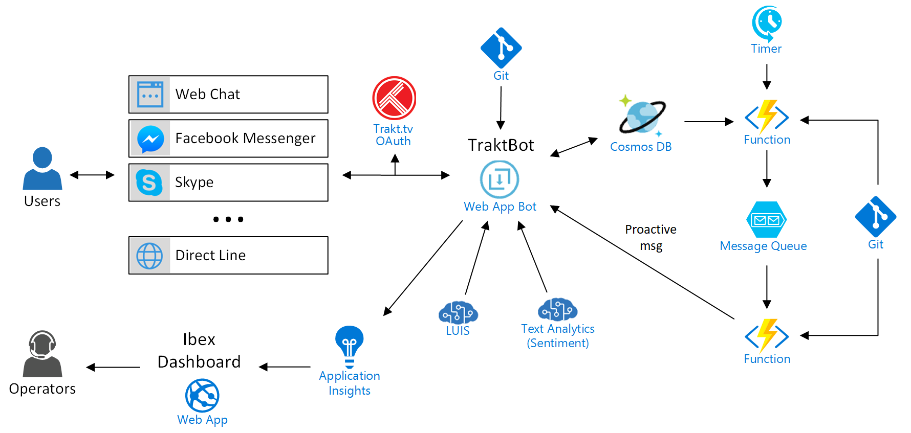

# Info
TraktBot is a chatbot sample that shows how to use Bot Builder SDK v3 for Node.js to create chatbots.
TraktBot consumes [Trakt.tv](https://trakt.tv) services. You can you use to get recommendation on shows, search for shows, figure out if a show is returning... and to mark a given episode as watched.

Some technical details.
- It has been developed with [Bot Builder SDK v3 for Node.js](https://docs.microsoft.com/en-us/azure/bot-service/nodejs/bot-builder-nodejs-overview), [TypeScript](https://www.typescriptlang.org/) and [Visual Studio Code](https://code.visualstudio.com/).
- It can be deployed in an **Azure Bot Web App** with [Bot Service](https://docs.microsoft.com/en-us/azure/bot-service/bot-service-quickstart) for high availability and scalability. Code can be  deployed from a git repository from e.g. GitHub or [VSTS](https://www.visualstudio.com/team-services/).
- It uses [LUIS](https://docs.microsoft.com/en-us/azure/bot-service/nodejs/bot-builder-nodejs-recognize-intent-luis) for Natural Language Processing.
- The bot is instrumented with [Microsoft Bot Builder Instrumentation](https://github.com/CatalystCode/botbuilder-instrumentation) which traces all messages to and from the bot, all intents detected by LUIS, and any custom event we may need in [Application Insights](https://azure.microsoft.com/en-us/services/application-insights/). We can then create custom BI dashboards in [Ibex Dashboard](https://github.com/Azure/ibex-dashboard) to consume that data. Bot Builder Instrumentation also performs sentiment analysis with [Text Analytics](https://azure.microsoft.com/en-us/services/cognitive-services/text-analytics/).
- Bot state data is persisted in [CosmosDB](https://docs.microsoft.com/en-us/azure/bot-service/nodejs/bot-builder-nodejs-state-azure-cosmosdb).
- The bot accepts inbound [dialog based Proactive Messages](https://docs.microsoft.com/en-us/azure/bot-service/nodejs/bot-builder-nodejs-proactive-messages). It first stores required conversation data for bot users in CosmosDB. A [Timer triggered](https://docs.microsoft.com/en-us/azure/azure-functions/functions-bindings-timer) Azure Function executes regularly to check if those users which conversation data is on CosmosDB need to be notified. If so, the Azure Function queues one job per user in an [Azure Storage queue](https://azure.microsoft.com/en-us/services/storage/queues/). Then, a [Queue triggered](https://docs.microsoft.com/en-us/azure/azure-functions/functions-bindings-storage-queue#trigger) Azure Function executes once per job and asks the bot to notify the appropriate user. The bot has an API endpoint to accept these notification requests. These Azure Functions can be found in my [traktbotnodefunctions_v3 GitHub project](https://github.com/magencio/traktbotnodefunctions_v3)
- It supports [localization](https://docs.microsoft.com/en-us/azure/bot-service/nodejs/bot-builder-nodejs-localization).
- It can authenticate users against Trakt.tv with [BotAuth](https://github.com/MicrosoftDX/botauth) library. Note: when using authentication you need an https endpoint. When debugging locally, you can create a proxy with e.g. [http-proxy](https://www.npmjs.com/package/http-proxy) npm package or use a tool like [ngrok](https://ngrok.com/). This sample uses http-proxy.
- Thanks to Bot Connector we should be able to connect the bot to many channels like Skype, Telegram, Facebook Messenger, Web Chat (to embed the chatbot in any web site), Direct Line (to create our own chatbot client), etc. We can configure this with Bot Service in the Azure portal.
- It uses [Trakt.tv API](https://trakt.docs.apiary.io/#). To access Trakt.tv API and authenticate users via OAuth I had to register my bot as a [Trakt.tv app](https://trakt.tv/oauth/applications). There I got my client ID & Secret, and registered my OAuth Redirect URIs for localhost & the Azure Web App.

*You can find a basic sample to use as a base for your own bots here: [BaseBotNode_v3](https://github.com/magencio/BaseBotNode_v3).*

## TODO
This sample is not finished yet. There are some things left to do:
- Implement the call to trakt.tv API to add watched episode for authenticated user.
- Separate season and episode selection in another dialog, to be able to show the user how many seasons the show has and how many episodes the selected season has.
- Add a help intent handler to some dialogs.
- As an example, add intent handlers to child dialogs for intents that should be processed by root dialog. Use: "session.cancelDialog('*:root', 'root');" in the handler so the root dialog can process the intent.
- As an example, make a child dialog to process the last message from user for a more specific intent handling. Use: "recognizeMode: RecognizeMode.onBegin" in the options of the constructor of the child dialog.

## Try the bot locally
Rename dev.sample.json to dev.private.json and modify it with your own settings. 

Then you can run the bot in different ways:

1) Run and debug the bot with VSCode by pressing Ctrl+Shift+D and selecting "Typescript debug", or by pressing F5). Note: if https proxy is not running yet, you will get an error saying: "The preLaunchTask 'proxy' cannot be tracked". Just select "Debug Anyway" to continue debugging.
Then connect the Bot Framework Emulator to http://localhost:3977/api/messages or to https://localhost:3978/api/messages. 

2) Run the bot with "npm run-script startdev". 
Then connect the Bot Framework Emulator to http://localhost:3977/api/messages or to https://localhost:3978/api/messages.
Note: if you make any changes in your code, the bot will be restarted automatically.

3) Get the packages and compile the .ts files to .js with "npm install", and the run the bot with "npm start".
Then connect the Bot Framework Emulator to http://localhost:3977/api/messages.
Note: this is what Azure does when you commit your code to Git and the bot gets deployed to the Web App.
Note: there won't be any https proxy running here, which is required for authentication. Proxy is not needed when running in Azure, as Azure automatically provides you with an https endpoint for the bot.